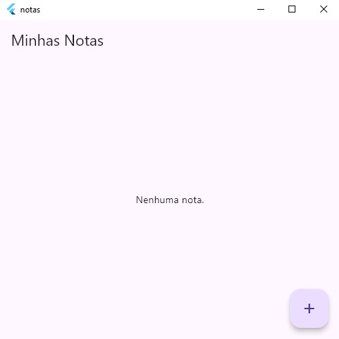
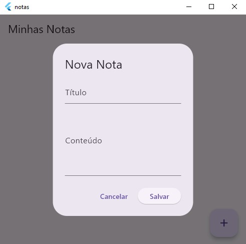
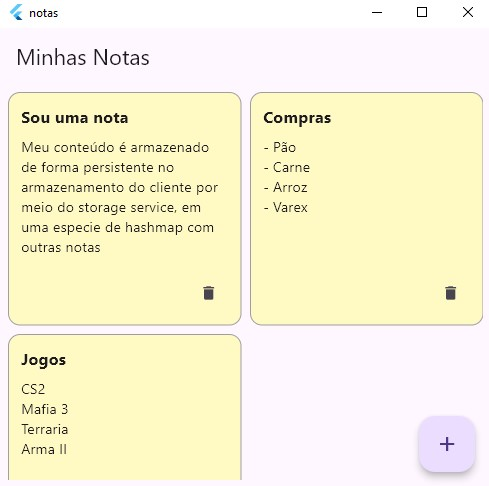

# Notas
Aplicativos de notas feito com Flutter como atividade para a disciplina de Programação Mobile II no Curso de Desenvolvimento de Sistemas na ETEC, ministrado pela Profª Renata Mirella.

# Como Rodar
Para compilar e rodar está aplicação você precisa instalar o [SDK do Flutter](https://flutter.dev/) no seu sistema. Após isso siga as instruções abaixo.

- Clone o repositório
```
git clone https://github.com/nukhes/notas
cd notas
```

- Instale as dependências
```
flutter pub get
```

- Rode o código
```
flutter run
```

# Imagens


